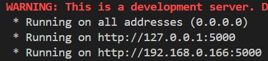

# SMD 學習平台

SMD 是一套以 Flask 與 Firebase Firestore 打造的線上題庫與測驗平台，作為資料庫課程的期末專案。使用者可以註冊帳號、依科目與章節練習選擇題、把不熟的題目加星號、查看自己的作答歷程，並建立只屬於自己的私人題庫。

> 專案最初版本的 README 已移至 [docs/README-original.md](docs/README-original.md)，其中包含當時的待辦清單與原始說明。

---

## 主要功能

- **帳號系統**：以 Flask-Login 管理登入狀態，密碼使用 bcrypt 雜湊後存入 Firestore；支援註冊、選擇頭像、修改個人資料與密碼、刪除帳號。
- **公開題庫**：所有人共用的科目與章節題目，存放在 Firestore 的 `SUBJECTS` 集合。
- **私人題庫**：每位使用者可以自行新增科目、章節與題目，存放在自己的 `USER/{uid}/SUBJECTS` 之下，在題庫列表中會與公開題庫合併顯示。
- **星號標記**：把想複習的題目標記起來，記錄在 `USER/{uid}/STARS`。
- **作答歷程**：每題累計作答次數與答對次數，記錄在 `USER/{uid}/HIST`。
- **測驗紀錄**：完成一次測驗後保存日期、正確率與題目清單，可回頭查看該次測驗的完整題目與當時狀態。
- **Wordle 小遊戲**：附帶的單字猜謎頁面。
- **Notion 題庫爬蟲**：把從 Notion 匯出的 HTML 題目批次寫入 Firestore。

## 技術架構

| 層級 | 使用技術 |
| --- | --- |
| 後端 | Python、Flask、Flask-Login |
| 資料庫 | Firebase Firestore（透過 `firebase-admin`） |
| 密碼保護 | bcrypt |
| 前端 | 原生 HTML / CSS / JavaScript，Jinja2 樣板 |
| 爬蟲 | BeautifulSoup 4 |

前端沒有使用任何框架或打包工具，所有頁面都由 Flask 以 Jinja2 直接算繪，靜態檔案則由 Flask 的 static 目錄提供。

## 目錄結構

```
SMD_Database_Project/
├── backend/
│   ├── __init__.py             # 讓 gunicorn 能以 backend.app:app 載入
│   ├── app.py                  # Flask 應用程式，所有路由與 Firestore 存取
│   ├── t.py                    # 手動測試 Firestore 查詢的暫存腳本
│   ├── 參考                     # 各 API 的前端呼叫範例
│   ├── 返回的json的格式.json      # get_questions 回傳格式範例
│   └── firebase_config2.json   # Firebase 服務帳戶金鑰（未納入版控）
├── crawler/
│   ├── crawl_notion.py         # 解析 Notion 匯出的 HTML 並寫入 Firestore
│   ├── seed_avatars.py         # 寫入頭像清單 USER/IMG
│   └── ch*.html                # 各章節的題目原始檔
├── static/
│   ├── html/                   # Jinja2 樣板，base.html 為共用外框
│   ├── css/                    # 各頁面對應的樣式表
│   ├── js/                     # 各頁面對應的前端邏輯
│   ├── resources/              # 科目封面圖、預設頭像（avatars/）等前端圖片
│   └── sound/                  # 答對與答錯音效
├── resources/                  # 網站圖示與說明文件用圖
├── docs/
│   └── README-original.md      # 專案最初版本的 README
├── Dockerfile                  # 正式環境映像檔（gunicorn）
├── .dockerignore
├── .gcloudignore               # 防止金鑰被上傳到 Cloud Build
├── requirements.txt
└── README.md
```

## 環境準備

### 1. 安裝套件

```bash
pip install -r requirements.txt
```

爬蟲另外需要 BeautifulSoup，尚未列入 `requirements.txt`：

```bash
pip install beautifulsoup4
```

### 2. 放入 Firebase 金鑰

`app.py` 依下列順序尋找 Firebase 憑證：

1. 環境變數 `GOOGLE_APPLICATION_CREDENTIALS` 指定的金鑰檔
2. `backend/firebase_config2.json`
3. 都沒有時改用執行環境的預設憑證（ADC），部署在 Cloud Run 時就是走這條路，不需要金鑰檔

本機開發時從 Firebase 主控台下載服務帳戶金鑰放到 `backend/firebase_config2.json` 即可。這個檔案已被 `.gitignore` 與 `.dockerignore` 排除。找不到任何憑證時應用程式會直接啟動失敗。

### 3. 環境變數

| 變數 | 說明 |
| --- | --- |
| `SECRET_KEY` | Flask session 簽章金鑰。本機未設定時會隨機產生（重新啟動後需重新登入）；正式環境必填，可用 `python -c "import secrets;print(secrets.token_hex(32))"` 產生 |
| `APP_ENV` | 設為 `production` 時要求 `SECRET_KEY`、關閉 debug，並讓 cookie 只透過 HTTPS 傳送。Docker 映像檔已預設為 `production` |
| `PORT` | 監聽埠，本機預設 `8787`，容器內預設 `8080` |

## 啟動方式

```bash
python backend/app.py
```

啟動後在終端機按住 `Ctrl` 並點擊網址即可開啟，預設監聽 `0.0.0.0:8787`，同網段的其他裝置也能連入。按 `Ctrl + C` 結束。



### 以 Docker 執行（與正式環境相同）

正式環境使用 gunicorn 啟動，而非 Flask 內建的開發伺服器。

```bash
docker build -t smd .
docker run --rm -p 8080:8080   -e SECRET_KEY=local-test   -e APP_ENV=development   -e GOOGLE_APPLICATION_CREDENTIALS=/secrets/key.json   -v "$PWD/backend/firebase_config2.json:/secrets/key.json:ro"   smd
```

之後開啟 <http://localhost:8080>。本機是 HTTP，所以要加上 `APP_ENV=development`，否則瀏覽器不會送出只限 HTTPS 的登入 cookie。金鑰只在執行時掛載進容器，不會被打包進映像檔。

## 部署（Google Cloud Run）

正式站：<https://smd-997597242855.asia-east1.run.app>

| 項目 | 設定 |
| --- | --- |
| GCP 專案 | `smd-project-8e531`（與 Firestore 同一個專案） |
| 地區 | `asia-east1`，與 Firestore 相同 |
| 執行身分 | `smd-run@smd-project-8e531.iam.gserviceaccount.com`，只有 Firestore 讀寫（`roles/datastore.user`）與讀取 `smd-secret-key` 的權限，不需要金鑰檔 |
| `SECRET_KEY` | 存在 Secret Manager 的 `smd-secret-key`，部署時以 `--set-secrets` 注入 |
| 規模 | 最少 0、最多 2 個執行個體，512 MiB 記憶體 |

### 更新版本

在本機建置映像檔、推送到 Artifact Registry，再部署到 Cloud Run：

```bash
IMG=asia-east1-docker.pkg.dev/smd-project-8e531/cloud-run-source-deploy/smd:$(date +%Y%m%d-%H%M%S)
docker build --platform linux/amd64 -t $IMG .
docker push $IMG
gcloud run deploy smd --image $IMG --region asia-east1 --project smd-project-8e531
```

第一次推送前需執行一次 `gcloud auth configure-docker asia-east1-docker.pkg.dev`。其餘設定（服務帳戶、Secret、執行個體數量）會沿用上一個版本，不必重複指定。

`gcloud run deploy --source .` 在這個專案目前會因為 Cloud Build 讀不到上傳的原始碼而失敗，所以改用本機建置。`.gcloudignore` 仍保留，確保若改用 `--source` 時金鑰不會被上傳。

### 回復到上一版

```bash
gcloud run revisions list --service smd --region asia-east1 --project smd-project-8e531
gcloud run services update-traffic smd --to-revisions <版本名稱>=100 --region asia-east1 --project smd-project-8e531
```

## 資料模型

Firestore 採用集合與文件交錯的巢狀結構。

### 公開題庫

```
SUBJECTS/{subject_id}/{unit_id}/{question_id}
SUBJECTS/{subject_id}/{unit_id}/meta        # { examtype, owner }
```

題目文件的欄位為 `Q`（題目）、`A`（答案）與 `O1` 到 `O5`（選項）。每個章節的 `meta` 文件記錄考試範圍與擁有者，不會被當成題目讀取。

### 使用者資料

```
USER/{uid}                                          # UserName, email, password, major, grade, img
USER/{uid}/SUBJECTS/{subject_id}/{unit_id}/{qid}    # 私人題庫，結構同公開題庫
USER/{uid}/STARS/{subject_id}/{unit_id}/{qid}       # { star: bool }
USER/{uid}/HIST/{subject_id}/{unit_id}/{qid}        # { answer: int, correct: int }
USER/{uid}/TEST_RECORDS/{record_id}                 # date, accuracy, num, questions
```

另有 `USER/IMG` 這份文件存放可選頭像清單，以及 `CONTACT_US` 集合存放聯絡表單的來信。

讀取題目時，後端會先查公開題庫，找不到才改查該使用者的私人題庫，因此同名科目章節會以公開版本優先。

## 路由一覽

### 頁面

| 路由 | 說明 | 需登入 |
| --- | --- | --- |
| `/` | 首頁 | 否 |
| `/login`、`/register`、`/choose_avatar` | 登入、註冊、選擇頭像 | 否 |
| `/about-us`、`/contact-us`、`/privacy`、`/terms` | 靜態頁面與聯絡表單 | 否 |
| `/sets` | 題庫列表，合併顯示公開與私人科目 | 是 |
| `/chapter?subject_id=..&unit_id=..` | 單一章節的題目瀏覽與編輯 | 是 |
| `/practice` | 練習模式 | 是 |
| `/test_record` | 測驗紀錄列表 | 是 |
| `/settings` | 個人資料、密碼、刪除帳號 | 是 |
| `/upgrade` | 升級 premium 的介紹頁 | 是 |
| `/wordle` | Wordle 小遊戲 | 是 |
| `/logout` | 登出 | 是 |

### JSON API

所有 API 都以 `POST` 搭配 JSON 主體呼叫，且都需要登入。

| 端點 | 用途 |
| --- | --- |
| `/get_questions` | 一次取得多個科目章節的題目，附帶星號與作答歷程 |
| `/get_private` | 取得目前使用者的私人題庫清單 |
| `/add_subject`、`/delete_subject` | 新增或刪除私人科目 |
| `/add_unit`、`/delete_unit` | 新增或刪除章節 |
| `/add_question`、`/delete_question` | 新增或刪除題目 |
| `/update_star` | 切換單題的星號狀態 |
| `/update_hist` | 批次累加多題的作答與答對次數 |
| `/add_test_record` | 保存一次測驗結果 |
| `/get_test_record` | 取得所有測驗紀錄摘要 |
| `/get_test_record_detail` | 依 `record_id` 取回該次測驗的完整題目 |
| `/get_img` | 取得可選頭像清單 |

每個端點的請求與回應範例集中在 [backend/參考](backend/參考)，`/get_questions` 的完整回傳格式另外收錄在 [backend/返回的json的格式.json](backend/返回的json的格式.json)。

## 題庫爬蟲與初始資料

`crawler/crawl_notion.py` 會讀取同目錄下的 `ch{章節}.html`（Notion 匯出檔），抽出題目、選項與答案，寫入公開題庫。科目與章節的對應寫在檔案開頭的 `SUBJECT_CHAPTERS`：

| 科目 | 章節 |
| --- | --- |
| `MANAGEMENT` | ch8、ch9、ch11、ch14、ch16、ch17、ch18 |
| `MACROECONOMICS` | ch202201、ch202301、ch202302、ch202501 |

`crawler/seed_avatars.py` 會把 `static/resources/avatars/` 內的圖片寫成頭像清單 `USER/IMG`，選頭像頁面需要它。

建立新的 Firebase 專案後，依序執行以下指令即可建立初始資料（可從任何目錄執行）：

```bash
pip install beautifulsoup4
python crawler/crawl_notion.py            # 試跑，只顯示各章題數
python crawler/crawl_notion.py --apply    # 寫入題庫
python crawler/seed_avatars.py            # 寫入頭像清單
```

## 已知問題與後續工作

- JSON API 尚未加上 CSRF 防護，目前僅靠 `SameSite=Lax` cookie 降低風險。
- 刪除帳號只移除 `USER` 的主文件，底下的子集合不會一併清除。
- `crawler/` 需要的 `beautifulsoup4` 未列入 `requirements.txt`（正式環境用不到）。
- 題庫爬蟲建立的章節沒有 `examtype`，題庫列表會顯示「無類型資訊」。
- `wordle_尚未放入SMD/` 內的音效檔尚未整併進主專案。

原始的功能待辦清單保留在 [docs/README-original.md](docs/README-original.md)。
