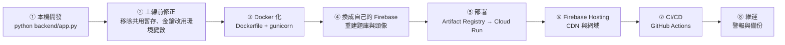
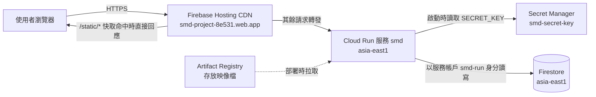
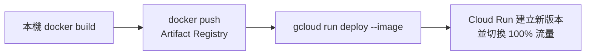
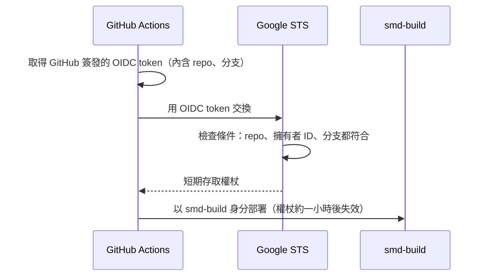

# 從本機到上線：SMD 學習平台的部署流程

這份文件說明 SMD 學習平台如何從「只能在自己電腦上跑的 Flask 專案」，一路變成打包好的 Docker 映像檔，最後部署到 Google Cloud Run 對外服務。每個步驟都會說明做了什麼，以及為什麼要這樣做。

日常操作指令（啟動、部署、回復）整理在 [README.md](../README.md)，這份文件著重在整體流程與背後的理由。

正式站：<https://smd-project-8e531.web.app>

---

## 全貌



上線後，一個請求的路徑如下：



---

## ① 起點：原本的樣子

專案原本是這樣執行的：

```bash
python backend/app.py
```

- Flask 內建的開發伺服器，`debug=True`，監聽 `0.0.0.0:8787`。
- Firebase 金鑰從固定路徑 `backend/firebase_config2.json` 讀取。
- 程式碼、樣板、靜態檔案都用相對路徑，所以**必須從專案根目錄執行**。

這在自己電腦上沒問題，但放到網路上會出事。原因見下一節。

---

## ② 上線前必須修的問題

| 問題 | 為什麼危險 | 怎麼修 |
| --- | --- | --- |
| 章節資料存在全域變數 `chapter_temp_mem` | 所有使用者共用同一份。A 打開章節後，B 重新整理 `/chapter` 會看到 A 的資料，包含 A 的私人題目 | `/chapter` 改為帶網址參數 `?subject_id=..&unit_id=..`，每次直接從 Firestore 讀取，全域變數整個移除 |
| `secret_key` 寫死在原始碼，且已公開在 GitHub | 任何人都能偽造登入 cookie，冒充任何使用者 | 改從環境變數 `SECRET_KEY` 讀取；正式環境沒設定就拒絕啟動 |
| `debug=True` | 發生錯誤時，網頁上會出現可以執行任意 Python 程式的除錯主控台 | 正式環境改用 gunicorn 啟動，`app.run` 只留給本機開發 |
| 金鑰路徑寫死、初始化失敗只印錯誤 | 部署環境沒有這個檔案；而且錯誤被吞掉，網站看似正常卻無法運作 | 依序嘗試 `GOOGLE_APPLICATION_CREDENTIALS` → 本機金鑰檔 → 雲端預設憑證；都失敗就直接中止 |
| 路徑依賴執行時所在目錄 | 換個目錄啟動就找不到樣板與圖示 | 用 `os.path.dirname(__file__)` 組成絕對路徑 |
| 登入後的 `next` 參數沒檢查 | 可被當成跳轉到釣魚網站的跳板 | 只接受站內路徑 |
| Cookie 沒有安全旗標 | Cookie 可能在非 HTTPS 連線中被竊取，或被 JavaScript 讀取 | 設定 `Secure`、`HttpOnly`、`SameSite=Lax` |
| 套件沒鎖定版本 | 每次安裝的版本可能不同，某天突然壞掉 | `requirements.txt` 鎖定版本，並加入 gunicorn |

程式用 `APP_ENV` 環境變數區分兩種模式：

| | 本機開發（預設） | 正式環境 `APP_ENV=production` |
| --- | --- | --- |
| `SECRET_KEY` 沒設定 | 自動產生隨機值（重開後要重新登入） | 拒絕啟動 |
| Debug | 開啟 | 關閉 |
| Cookie `Secure` | 關閉（本機是 HTTP） | 開啟（只透過 HTTPS 傳送） |

---

## ③ Docker 化

### 為什麼要用 Docker

「在我電腦上可以跑」不代表在伺服器上也可以。Docker 把**程式碼、Python 版本、所有套件**打包成一個映像檔（image），在任何地方執行的結果都一樣。Cloud Run 也是直接執行映像檔。

### Dockerfile 逐段說明

```dockerfile
# 以精簡版 Python 3.12 為基底
FROM python:3.12-slim

# PYTHONUNBUFFERED：log 立即輸出，Cloud Run 才看得到
# APP_ENV=production：映像檔預設就是正式環境模式
ENV PYTHONDONTWRITEBYTECODE=1 \
    PYTHONUNBUFFERED=1 \
    APP_ENV=production \
    PORT=8080

WORKDIR /app

# 先只複製套件清單並安裝，程式碼改動時這層可以沿用快取
COPY requirements.txt .
RUN pip install --no-cache-dir -r requirements.txt

# 只複製執行需要的檔案
COPY backend/__init__.py backend/app.py backend/
COPY static/ static/
COPY resources/icon.png resources/

# 不以 root 身分執行，降低被入侵時的影響
RUN useradd --create-home appuser
USER appuser

CMD exec gunicorn --bind :$PORT --workers 1 --threads 8 --timeout 0 backend.app:app
```

### 為什麼用 gunicorn 而不是 `python app.py`

Flask 內建伺服器只為開發設計，一次處理能力有限，官方也明確說明不可用於正式環境。gunicorn 是正式的 WSGI 伺服器：

- `--workers 1 --threads 8`：一個行程、八個執行緒，可同時處理多個請求。Cloud Run 需要時會自己多開執行個體，所以不需要多個 worker。
- `--timeout 0`：交給 Cloud Run 控制逾時。
- `backend.app:app`：載入 `backend/app.py` 裡的 `app` 物件。為此新增了空的 `backend/__init__.py`，讓 `backend` 成為可匯入的套件。

### 三個 ignore 檔案

| 檔案 | 作用在 | 目的 |
| --- | --- | --- |
| `.gitignore` | git | 金鑰不會被 commit 到 GitHub |
| `.dockerignore` | `docker build` | 金鑰、爬蟲、文件不會被打包進映像檔 |
| `.gcloudignore` | `gcloud ... --source` | 金鑰不會被上傳到 Cloud Build |

三個都排除了 `firebase_config*.json` 與 `*firebase-adminsdk*.json`。**金鑰只存在你的電腦上，從不進入 git、映像檔或雲端。**

### 在本機用 Docker 執行

```bash
docker build -t smd .
docker run --rm -p 8080:8080 \
  -e SECRET_KEY=local-test \
  -e APP_ENV=development \
  -e GOOGLE_APPLICATION_CREDENTIALS=/secrets/key.json \
  -v "$PWD/backend/firebase_config2.json:/secrets/key.json:ro" \
  smd
```

- 金鑰以 `-v` **在執行時掛載**進容器，不會留在映像檔裡。
- 本機是 HTTP，要加 `APP_ENV=development`，否則瀏覽器不會送出只限 HTTPS 的登入 cookie，會一直登入失敗。

---

## ④ 換成自己的 Firebase 專案

原本使用的 Firebase 專案屬於別人，而且兩把舊金鑰都已被撤銷（`account not found`），無法再讀取舊資料。因此改用自己的新專案 `smd-project-8e531`，並從 repo 內的檔案重建資料。

1. **建立 Firestore**：地區選 `asia-east1`（台灣），之後無法更改；安全規則選 production mode。後端使用 Admin SDK 不受規則限制，前端也不直接連 Firebase，所以全部拒絕最安全。
2. **放入新金鑰**：從 Firebase 主控台下載服務帳戶金鑰，存為 `backend/firebase_config2.json`。
3. **重建題庫**：修正後的 [crawler/crawl_notion.py](../crawler/crawl_notion.py) 解析 `crawler/ch*.html`：

   | 科目 | 章節 | 題數 |
   | --- | --- | --- |
   | `MANAGEMENT` | ch8、9、11、14、16、17、18 | 595 |
   | `MACROECONOMICS` | ch202201、202301、202302、202501 | 87 |

   原本的爬蟲把管理學章節也寫進總經、讀不到 `A)` 格式的選項，也沒有建立科目文件（沒有科目文件，題庫列表就不會顯示該科目），這些都已修正。
4. **建立頭像清單**：[crawler/seed_avatars.py](../crawler/seed_avatars.py) 把 `static/resources/avatars/` 的預設頭像寫入 `USER/IMG`。

```bash
pip install beautifulsoup4
python crawler/crawl_notion.py            # 試跑，只顯示題數
python crawler/crawl_notion.py --apply    # 寫入
python crawler/seed_avatars.py
```

舊資料庫中沒有本機備份的科目（資料庫管理、投資學等）與所有舊帳號無法復原。

---

## ⑤ 部署到 Cloud Run

### 為什麼選 Cloud Run

| 考量 | 說明 |
| --- | --- |
| 與 Firestore 同一個 GCP 專案 | 用服務帳戶直接存取 Firestore，雲端上完全不需要金鑰檔 |
| 費用 | 沒有流量時縮到 0 個執行個體，課程專案的流量在免費額度內 |
| HTTPS | 自動提供網址與憑證 |
| 地區 | `asia-east1`，與 Firestore 同地區，延遲最低 |

代價是閒置後第一個請求需要 2～3 秒啟動（冷啟動）。

### 一次性設定（已完成）

| 步驟 | 內容 | 為什麼 |
| --- | --- | --- |
| 升級 Blaze 方案並設定預算警示 | Cloud Run 需要綁定帳單；警示避免意外花費 | |
| 啟用 API | Cloud Run、Cloud Build、Artifact Registry、Secret Manager | |
| 建立執行用服務帳戶 `smd-run` | 只有 `roles/datastore.user`（Firestore 讀寫）與讀取 `smd-secret-key` 的權限 | Cloud Run 預設使用的帳戶擁有整個專案的 Editor 權限，萬一網站被入侵影響太大 |
| 建立 Secret `smd-secret-key` | 隨機 64 字元的 `SECRET_KEY` | 金鑰不出現在程式碼、映像檔或指令參數中 |
| 建立建置用服務帳戶 `smd-build` | `roles/run.builder`，保留給 CI/CD 使用 | |

### 部署流程

> 以下是手動部署的方式。設定 CI/CD 後，push 到 `main` 會自動完成同樣的步驟，見 ⑦。



```bash
# 第一次需要：讓 docker 能推送到 Artifact Registry
gcloud auth configure-docker asia-east1-docker.pkg.dev

IMG=asia-east1-docker.pkg.dev/smd-project-8e531/cloud-run-source-deploy/smd:$(date +%Y%m%d-%H%M%S)
docker build --platform linux/amd64 -t $IMG .
docker push $IMG
gcloud run deploy smd --image $IMG --region asia-east1 --project smd-project-8e531
```

第一次部署時另外指定了以下設定，之後的部署會自動沿用：

```bash
--service-account smd-run@smd-project-8e531.iam.gserviceaccount.com
--set-secrets SECRET_KEY=smd-secret-key:latest
--allow-unauthenticated               # 公開網站，任何人都能瀏覽
--min-instances 0 --max-instances 2   # 閒置不收費；上限避免流量暴增產生費用
--memory 512Mi --cpu 1 --concurrency 40
```

映像檔標籤用時間戳記，每一版都保留在 Artifact Registry，方便追查與回復。

### 回復到上一版

Cloud Run 保留每次部署的版本（revision），出問題時可以立即把流量切回去，不需要重新建置：

```bash
gcloud run revisions list --service smd --region asia-east1 --project smd-project-8e531
gcloud run services update-traffic smd --to-revisions <版本名稱>=100 --region asia-east1 --project smd-project-8e531
```

---

## ⑥ Firebase Hosting：CDN 與網域

Cloud Run 本身就有 HTTPS 網址，再加上 Firebase Hosting 是為了兩件事：

- **CDN 快取**：CSS、JS、圖片由全球的 CDN 節點直接回應，不必每次都喚醒 Cloud Run。
- **自訂網域**：在 Firebase 主控台就能綁定自己的網域並自動申請憑證。

設定只有 [firebase.json](../firebase.json) 一條規則：所有路徑轉給 Cloud Run 服務 `smd`。`hosting/` 資料夾內的檔案（目前只有 `robots.txt`）會由 Hosting 直接提供，優先於轉發規則，所以**不要在 `hosting/` 放 `index.html`**，否則首頁會被蓋掉。

為了配合 Hosting，程式做了三項調整：

| 調整 | 原因 |
| --- | --- |
| Session cookie 改名為 `__session` | Hosting 轉發到 Cloud Run 時會**移除所有 cookie，只保留 `__session`**。沒改名的話，透過 Hosting 網址永遠無法登入 |
| 靜態檔回應 `Cache-Control: public, max-age=86400` | 讓 CDN 與瀏覽器快取一天 |
| 靜態檔網址自動加上 `?v=<版本>` | 部署新版後網址改變，CDN 會抓新檔案，不會出現新 HTML 配舊 CSS 的情況 |
| 其他回應加上 `Cache-Control: private, no-cache` | 頁面含有個人資料，明確禁止 CDN 快取 |

驗證結果：同一個 CSS 第一次 `X-Cache: MISS`，之後都是 `HIT`；登入後的頁面永遠是 `MISS`。

### 綁定自訂網域

需要一個自己的網域（例如在 Cloudflare、Namecheap、GoDaddy 購買）：

1. Firebase 主控台 → Hosting → **新增自訂網域**，輸入網域。
2. 依畫面指示到網域商的 DNS 設定加入 TXT（驗證擁有權）與 A 記錄。
3. 等待 DNS 生效與憑證簽發（數分鐘到 24 小時）。

程式不需要任何修改：所有轉址都是相對路徑，cookie 也沒有綁定網域。

---

## ⑦ CI/CD：GitHub Actions

### 不在 GitHub 存金鑰：Workload Identity Federation

傳統做法是把服務帳戶金鑰 JSON 存進 GitHub Secrets，但金鑰一旦外洩就能長期使用。Workload Identity Federation（WIF）改為：



WIF provider 的條件限定 **`Jason930930/SMD_Database_Project` 的 `main` 分支**，並比對 repo 擁有者的數字 ID，避免 repo 改名或被刪除後有人註冊同名 repo 冒用。其他 repo、fork 或分支都無法取得權限。

### 部署帳戶 smd-build 的權限

| 權限 | 範圍 | 用途 |
| --- | --- | --- |
| `roles/run.developer` | 專案 | 部署 Cloud Run 新版本 |
| `roles/iam.serviceAccountUser` | 只限 `smd-run` | 讓新版本以 `smd-run` 身分執行 |
| `roles/artifactregistry.writer` | 只限 `cloud-run-source-deploy` 儲存庫 | 推送映像檔 |
| `roles/firebasehosting.admin` | 專案 | 部署 Hosting |
| `roles/serviceusage.serviceUsageConsumer` | 專案 | Firebase CLI 檢查 API 狀態 |
| `roles/run.builder` | 專案 | 之前嘗試 Cloud Build 時加入，目前未使用 |

### 兩個 workflow

| Workflow | 觸發 | 步驟 |
| --- | --- | --- |
| [deploy.yml](../.github/workflows/deploy.yml) | push 到 `main`（排除文件、爬蟲、Hosting 設定）、pull request、手動 | **build**：檢查語法、建置映像檔。**deploy**（只在 `main`）：WIF 登入 → 建置並推送 `smd:<commit>` → 部署 Cloud Run 並設定 `APP_VERSION` → 冒煙測試首頁、登入頁、CSS |
| [hosting.yml](../.github/workflows/hosting.yml) | `firebase.json`、`.firebaserc`、`hosting/` 有變動，或手動 | WIF 登入 → `firebase deploy --only hosting` |

Pull request 只會執行 build job，不會取得任何雲端權限。部署失敗時舊版本會繼續服務，因為 Cloud Run 只在新版本啟動成功後才切換流量。

---

## ⑧ 維運：警報與備份

### 警報

通知寄到專案擁有者的 Google 帳號信箱，可在 Cloud Console → Monitoring → Alerting 修改。

| 警報 | 條件 | 收到時該做什麼 |
| --- | --- | --- |
| SMD: 5xx errors | 5 分鐘內超過 5 次伺服器錯誤 | 到 Cloud Run → smd → 記錄查看錯誤；若是新版本造成，回復到上一版 |
| SMD: site down | 首頁可用性檢查（每 15 分鐘，從亞洲、美國、歐洲）連續失敗 10 分鐘 | 確認 Cloud Run 與 Firebase Hosting 狀態 |

### Firestore 備份

| 機制 | 頻率 | 保留 | 適合的情況 |
| --- | --- | --- | --- |
| 每日備份 | 每天 | 7 天 | 發現昨天的資料被誤刪 |
| 每週備份 | 每週日 | 8 週 | 過了好幾週才發現問題 |
| PITR（時間點還原） | 連續 | 7 天，精確到分鐘 | 知道確切出錯時間，例如「10:05 跑錯腳本」 |
| 刪除保護 | — | — | 防止整個資料庫被誤刪 |

還原一律寫到新的資料庫，不會覆蓋現有資料，指令見 [README 的還原段落](../README.md#從備份還原-firestore)。

---

## 機密資訊放在哪裡

| 機密 | 本機 | 映像檔 | GitHub | 雲端 |
| --- | --- | --- | --- | --- |
| Firebase 服務帳戶金鑰 | `backend/firebase_config2.json` | ❌ | ❌ | ❌ 不需要，Cloud Run 以 `smd-run` 身分存取 |
| `SECRET_KEY` | 不需要（開發模式自動產生） | ❌ | ❌ | Secret Manager `smd-secret-key` |
| GitHub Actions 的部署權限 | — | — | ❌ 不存金鑰 | WIF 每次發給短期權杖，只限本 repo 的 `main` 分支 |

git 歷史中仍留有舊的寫死 `secret_key`，但正式站使用 Secret Manager 中的新值，舊值已經沒有作用。

---

## 過程中遇到的問題

| 狀況 | 原因 | 解法 |
| --- | --- | --- |
| 安裝 gcloud 後指令找不到 | 已開啟的終端機沒有讀到新的 PATH | 重新開啟終端機 |
| 本機 Docker 執行時一直登入失敗 | 映像檔預設 `APP_ENV=production`，cookie 只在 HTTPS 送出 | 本機執行加 `-e APP_ENV=development` |
| Secret 長度是 70 而不是 64 | Windows PowerShell 5.1 以管線傳給外部程式時會加入額外字元 | 改用 Git Bash 建立 Secret，並銷毀錯誤的版本 |
| `gcloud run deploy --source .` 失敗（PERMISSION_DENIED） | Cloud Build 讀不到上傳的原始碼，換成專用建置帳戶也一樣 | 改為本機建置並推送映像檔，再以 `--image` 部署 |
| 用 curl 測試刪除帳號得到 `411` | 沒有內容的 POST 缺少 `Content-Length`，Google 前端會拒絕 | 只影響測試；瀏覽器送出表單時一定會帶內容 |

---

## 還沒做的事

- **自訂網域**：需要先購買網域，步驟見 ⑥。
- **CSRF 防護**：JSON API 目前只靠 `SameSite=Lax` cookie。
- **登入頻率限制**：尚未防範暴力嘗試密碼。
